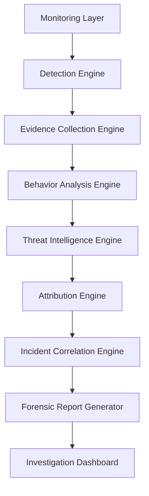
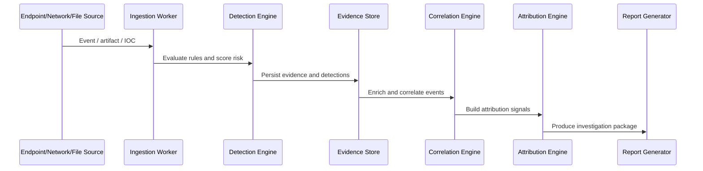
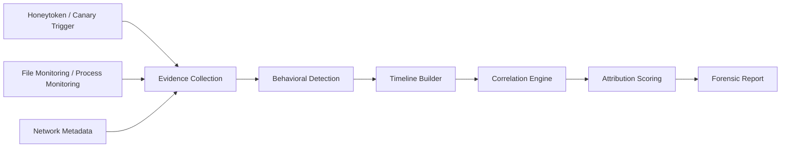
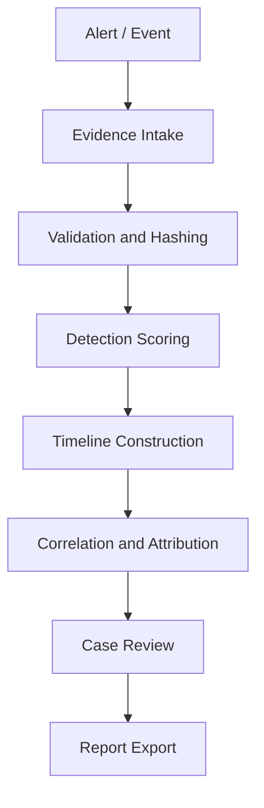
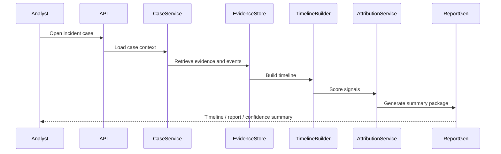

# Advanced DFIR & Ransomware Attribution Module

This document defines a defensive, evidence-first DFIR architecture for Digital Defense Hub (DDH). It is designed to support forensic evidence preservation, incident correlation, ransomware behavior analysis, and confidence-based attribution without crossing into unauthorized access or unsupported claims.

## 1. Design Principles

- Defensive only: detect, preserve, analyze, report, and support response.
- Evidence-first: every conclusion must be tied to observed data.
- Confidence-based inference: never present unsupported certainty as fact.
- Legal and ethical operation: no unauthorized access, no remote compromise, no camera/microphone access.
- Explainable scoring: every risk or attribution score must be explainable.
- Tenant-safe: evidence and indicators remain scoped to the owning organization.

---

## 2. Domain-Driven Architecture

### Core Layers



### Domain Areas

- Monitoring Layer
  - File monitoring
  - Honeytoken / canary events
  - Endpoint telemetry ingestion
  - Network metadata ingestion
  - Threat feed and alert ingestion

- Detection Engine
  - Ransomware behavior rules
  - Suspicious process behavior
  - Suspicious persistence and registry changes
  - Lateral movement indicators
  - Data collection / staging alerts

- Evidence Collection Engine
  - File hashes and metadata
  - Network session evidence
  - Endpoint telemetry evidence
  - Malware analysis artifacts
  - Memory forensic evidence placeholders

- Behavior Analysis Engine
  - Timeline reconstruction
  - Sequence analysis
  - Attack stage correlation
  - Entity linking

- Threat Intelligence Engine
  - IOC enrichment
  - Reputation scoring
  - Malware family and infrastructure correlation

- Attribution Engine
  - Infrastructure overlap detection
  - Campaign correlation
  - Confidence-based attribution scoring

- Incident Correlation Engine
  - Cross-incident clustering
  - Device / org / campaign correlation

- Forensic Report Generator
  - PDF and JSON report exports
  - Evidence bundle generation
  - Chain of custody support

---

## 3. Go Package Structure

```text
backend-go/internal/
  dfir/
    detection/
      rules.go
      scorer.go
      evaluator.go
    evidence/
      collector.go
      repository.go
      model.go
    attribution/
      service.go
      scorer.go
      correlator.go
    timeline/
      builder.go
      replay.go
    correlation/
      engine.go
      clustering.go
    reporting/
      generator.go
      export.go
    dashboard/
      summary.go
    storage/
      evidence_store.go
      custody.go
    worker/
      ingestion_worker.go
      enrichment_worker.go
      correlation_worker.go
    api/
      handler.go
      routes.go
  honeytoken/            # existing module extension
  canary/                # existing module extension
  preencryption/         # existing ransomware detection integration
  deepfakeforensics/    # evidence and report integration
  notification/         # investigation alerting
  investigation/        # investigation case integration
```

### Suggested Integration Points

- Reuse existing modules for:
  - Honeytoken and canary event collection
  - Threat and incident entities
  - Investigation case workflows
  - Deepfake / media evidence packaging
  - Notification and audit logging

---

## 4. PostgreSQL Schema

### Core Tables

```sql
CREATE TABLE dfir_cases (
    id UUID PRIMARY KEY,
    organization_id UUID NOT NULL,
    title TEXT NOT NULL,
    severity TEXT NOT NULL,
    status TEXT NOT NULL,
    first_seen_at TIMESTAMPTZ NOT NULL,
    last_seen_at TIMESTAMPTZ NOT NULL,
    created_at TIMESTAMPTZ NOT NULL DEFAULT NOW(),
    updated_at TIMESTAMPTZ NOT NULL DEFAULT NOW()
);

CREATE TABLE dfir_incidents (
    id UUID PRIMARY KEY,
    organization_id UUID NOT NULL,
    case_id UUID REFERENCES dfir_cases(id),
    incident_type TEXT NOT NULL,
    title TEXT NOT NULL,
    summary TEXT,
    confidence_score NUMERIC(5,2),
    status TEXT NOT NULL,
    created_at TIMESTAMPTZ NOT NULL DEFAULT NOW()
);

CREATE TABLE dfir_evidence_artifacts (
    id UUID PRIMARY KEY,
    organization_id UUID NOT NULL,
    incident_id UUID REFERENCES dfir_incidents(id),
    artifact_type TEXT NOT NULL,
    source_type TEXT NOT NULL,
    source_name TEXT,
    storage_path TEXT NOT NULL,
    sha256 TEXT NOT NULL,
    sha1 TEXT,
    md5 TEXT,
    file_size_bytes BIGINT,
    file_entropy NUMERIC(8,4),
    collected_at TIMESTAMPTZ NOT NULL DEFAULT NOW(),
    chain_of_custody_token TEXT,
    integrity_verified BOOLEAN NOT NULL DEFAULT TRUE
);

CREATE TABLE dfir_evidence_hashes (
    id UUID PRIMARY KEY,
    artifact_id UUID REFERENCES dfir_evidence_artifacts(id),
    hash_type TEXT NOT NULL,
    hash_value TEXT NOT NULL,
    created_at TIMESTAMPTZ NOT NULL DEFAULT NOW()
);

CREATE TABLE dfir_events (
    id UUID PRIMARY KEY,
    organization_id UUID NOT NULL,
    incident_id UUID REFERENCES dfir_incidents(id),
    event_type TEXT NOT NULL,
    source_type TEXT NOT NULL,
    source_id UUID,
    actor_user_id UUID,
    device_id UUID,
    event_time TIMESTAMPTZ NOT NULL,
    payload JSONB NOT NULL DEFAULT '{}'::jsonb,
    severity_score NUMERIC(5,2),
    created_at TIMESTAMPTZ NOT NULL DEFAULT NOW()
);

CREATE TABLE dfir_entities (
    id UUID PRIMARY KEY,
    organization_id UUID NOT NULL,
    entity_type TEXT NOT NULL,
    entity_value TEXT NOT NULL,
    confidence_score NUMERIC(5,2),
    first_seen_at TIMESTAMPTZ NOT NULL,
    last_seen_at TIMESTAMPTZ NOT NULL,
    metadata JSONB NOT NULL DEFAULT '{}'::jsonb
);

CREATE TABLE dfir_iocs (
    id UUID PRIMARY KEY,
    organization_id UUID NOT NULL,
    indicator_type TEXT NOT NULL,
    indicator_value TEXT NOT NULL,
    threat_family TEXT,
    confidence_score NUMERIC(5,2),
    first_seen_at TIMESTAMPTZ,
    last_seen_at TIMESTAMPTZ,
    metadata JSONB NOT NULL DEFAULT '{}'::jsonb
);

CREATE TABLE dfir_timeline_events (
    id UUID PRIMARY KEY,
    case_id UUID REFERENCES dfir_cases(id),
    event_id UUID REFERENCES dfir_events(id),
    sequence_number INT NOT NULL,
    event_label TEXT NOT NULL,
    event_time TIMESTAMPTZ NOT NULL,
    created_at TIMESTAMPTZ NOT NULL DEFAULT NOW()
);

CREATE TABLE dfir_attribution_signals (
    id UUID PRIMARY KEY,
    organization_id UUID NOT NULL,
    incident_id UUID REFERENCES dfir_incidents(id),
    signal_type TEXT NOT NULL,
    signal_value TEXT NOT NULL,
    signal_strength NUMERIC(5,2),
    evidence_count INT NOT NULL DEFAULT 0,
    created_at TIMESTAMPTZ NOT NULL DEFAULT NOW()
);

CREATE TABLE dfir_attribution_assessments (
    id UUID PRIMARY KEY,
    organization_id UUID NOT NULL,
    incident_id UUID REFERENCES dfir_incidents(id),
    attribution_label TEXT,
    confidence_score NUMERIC(5,2),
    explanation TEXT,
    created_at TIMESTAMPTZ NOT NULL DEFAULT NOW()
);
```

### Recommended Indexes

- `dfir_events(event_time)`
- `dfir_events(incident_id, event_type)`
- `dfir_evidence_artifacts(sha256)`
- `dfir_iocs(indicator_type, indicator_value)`
- `dfir_timeline_events(case_id, event_time)`

---

## 5. Event Flow Diagrams

### Ingestion and Correlation Flow



### Ransomware Investigation Flow



---

## 6. Detection Engine Design

### Detection Categories

1. Ransomware behavior
   - mass file modification
   - rapid rename
   - high entropy file creation
   - extension changes
   - shadow copy deletion
   - backup deletion
   - suspicious PowerShell / script execution
   - service termination
   - registry tampering
   - privilege escalation attempts

2. Lateral movement indicators
   - unusual SMB / RDP / PsExec behavior
   - repeated service creation
   - unusual admin account usage

3. Data staging / exfiltration behavior
   - archive creation
   - compression
   - unusual network destinations
   - large outbound transfers

4. Honeytoken and canary abuse
   - decoy credential access
   - honey file access
   - canary file rename / copy / move / delete

### Scoring Model

Each detection rule emits:

- indicators
- weight
- confidence
- false-positive reduction checks
- related events
- recommended investigation steps

Example scoring:

```text
Score = Σ(rule_weight × confidence × context_factor) - FP_penalties
```

### Example Rule Classes

- File encryption burst: +40
- Shadow copy deletion: +30
- Backup deletion: +25
- Suspicious PowerShell execution: +20
- Canary access: +20
- Honeytoken trigger: +25
- Privilege escalation attempt: +25
- Unusual outbound connection: +15

The engine should return:

- `risk_score`
- `confidence`
- `evidence_ids`
- `explanation`
- `investigation_steps`

---

## 7. Investigation Workflow

1. Ingest evidence
   - file events
   - network metadata
   - endpoint telemetry
   - canary / honeytoken events
   - threat intelligence hits

2. Create or update incident
   - create a case if not already open
   - attach observations and evidence

3. Evaluate detection rules
   - produce a score and explanation
   - determine if the case should be escalated

4. Build timeline
   - order events chronologically
   - show major stages: initial access, execution, persistence, encryption, exfiltration

5. Correlate with related incidents
   - same infrastructure
   - same malware family
   - same IP/domain/certificate overlap

6. Generate report
   - evidence summary
   - timeline
   - impacts
   - recommendations
   - chain of custody status

---

## 8. DFIR Workflow

### Evidence Preservation

- Hash every artifact at collection time.
- Store immutable metadata with original filenames and timestamps.
- Record chain-of-custody entries for each artifact.
- Validate integrity before report export.

### Investigation Lifecycle



### Evidence Handling Rules

- Only preserve what is legally and technically reachable.
- Distinguish direct evidence from inferred context.
- Do not claim exact physical identity or location.
- Mark all attribution output as confidence-based.

---

## 9. API Design

### Example API Groups

```text
POST /api/v1/dfir/incidents
GET  /api/v1/dfir/incidents/:id
GET  /api/v1/dfir/incidents/:id/timeline
POST /api/v1/dfir/evidence
GET  /api/v1/dfir/evidence/:id
POST /api/v1/dfir/attribution/:incident_id/recompute
GET  /api/v1/dfir/attribution/:incident_id
GET  /api/v1/dfir/cases/:id/summary
POST /api/v1/dfir/reports/:incident_id/export
```

### Request Examples

- Evidence upload: multipart file plus metadata and source type
- Incident creation: title, incident type, severity, initial evidence IDs
- Attribution request: incident ID and optional scope filters
- Report export: format `pdf` or `json`

---

## 10. Background Worker Architecture

### Worker Types

- Ingestion Worker
  - collects events and artifacts
  - normalizes payloads
  - writes evidence records

- Enrichment Worker
  - adds IOC enrichment
  - resolves threat families
  - links to prior incidents

- Correlation Worker
  - clusters incidents
  - updates attribution signals
  - updates case summaries

- Report Worker
  - generates PDF / JSON reports
  - prepares export bundles

### Worker Queue Design

Use Redis or a durable internal queue for:

- evidence ingestion jobs
- enrichment jobs
- timeline rebuild jobs
- correlation recalculation jobs
- report export jobs

---

## 11. Evidence Storage Design

### Storage Strategy

- Store original artifacts in protected storage with tenant isolation.
- Store metadata and hashes in PostgreSQL.
- Use immutable evidence records with versioning.
- Preserve original filename, source, timestamps, and collection context.

### Evidence Bundle Structure

```text
evidence-bundle/
  manifest.json
  artifact.bin
  metadata.json
  chain-of-custody.json
  report.pdf
```

### Integrity Controls

- SHA-256 verification
- hash comparison on export
- timestamped custody ledger
- audit trail for all access

---

## 12. Sequence Diagram for Investigation Review



---

## 13. Production-Ready Implementation Roadmap

### Phase 1 — Evidence Intake Foundation

- Add DFIR case, incident, evidence, event, and IOC tables
- Implement evidence hashing and custody tracking
- Add basic evidence upload and retrieval APIs
- Integrate with existing honeytoken/canary event streams

### Phase 2 — Detection and Scoring

- Implement rule-based ransomware scoring
- Add suspicious behavior evaluation
- Add high-level threat score generation
- Add explainable reasoning fields

### Phase 3 — Timeline and Correlation

- Build timeline reconstruction
- Add cross-incident correlation
- Add entity linking for IP/domain/host/process relationships

### Phase 4 — Attribution Engine

- Implement signal aggregation and confidence scoring
- Add campaign / infrastructure overlap analysis
- Produce evidence-backed attribution summaries

### Phase 5 — Reporting and Dashboards

- Add investigation dashboards
- Implement report export in PDF and JSON
- Add evidence bundles and audit summaries

### Phase 6 — Hardening and Operations

- Add rate limits, role-based access, retention policies
- Add worker monitoring and replay capabilities
- Add false-positive tuning and rule review workflows

---

## 14. Recommended Initial Scope for DDH

To keep the implementation technically accurate and practical, the first production milestone should focus on:

1. evidence ingestion and preservation
2. honeytoken/canary-generated incident enrichment
3. ransomware behavior detection scoring
4. incident timeline generation
5. investigation case integration
6. report export and evidence bundle generation

That scope will deliver a credible DFIR experience without overreaching into unsupported capabilities.
